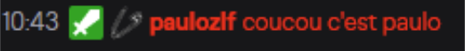

# Récap des commandes utiles pour votre modération

**[Retour à l'accueil](https://github.com/ZiiwAy/doc)**


## COMMANDES DIFFUSEUR :

Pour mettre modérateur une personne :
```
/mod <user>
```       
Pour retirer un modérateur :

```
/unmod <user>
```     
Pour donner le statut VIP à quelqu’un :

```
/vip <user>
```       
Retire le statut VIP :

```
/unvip <user>
```     


## COMMANDES MODERATEURS & DIFFUSEURS :


De base lance une pub de 30s : 
```
/commercial
```				
Lance une pub de la durée précisée : 
```
/commercial <temps en s>
```		
Host sur votre chaîne, une chaîne qui diffuse en ce moment : 
```
/host <user>
```
Pour couper l’hébergement:
```
/unhost
```				
Pour lancer un raid sur la chaîne de votre choix : 
```
/raid <user>
```				

Ouvre les paramètres pour lancer un sondage dans le chat :
```
/poll
```					
Supprime le sondage en cours : 
```
/deletepoll
```				
Termine le sondage en cours :
```
/endpoll
```				
Active le mode lent dans le chat pour que ça soit plus lisible pour le streameur et contrôlable pour les modos :
```
/slow <temps en s>			
```
Coupe le mode lent :
```
/slowoff
```				
Active le mode réservé qu’AUX subs (oblige en quelques sortes les autres à sub pour pouvoir parler) : 
```
/subsribers		
```
Disable le mode : 
```
/subscribersoff
```			
Ban temporaire :
```
/timeout <user> <temps en s>	
```
Lève le ban :
```
/untimeout <user>
```			
Ban perm : 
```
/ban <user>
```				
Lève le ban : 
```
/unban <user>
```			


## LES COMMANDES NIGHTBOT COMMUNES :

Pour changer le titre du live (à faire de préférence avant de lancer) :
```
!title <nouveau nom du live>
```
Tire au hasard quelqu’un du chat (il faut que la personne ait parlé au cours des 10 dernières min pour être éligible au tirage random) :
```
!winner
```

Autre option pour faire un sondage :
```
!poll new <titre> | <choix 1> | <choix 2> 		
```
*Pour rajouter un choix, il suffit juste de mettre | <choix n> à la suite*


## LES COMMANDES POUR TOUT LE MONDE :


Empêche la personne de parler avec vous : 
```
/block <user>				
```
Disable la restriction : 
```
/unblock <user>		
```	
Pour changer votre couleur de pseudo dans le chat : 
```
/color <couleur en anglais>	
```	
Pour afficher votre dans la couleur de votre pseudo : 
```
/me <votre message>		
```
<div style="text-align:center"></div>

Pour afficher la liste de modérateurs de la chaîne :
```
/mods
``` 					
Affiche la liste des VIPs de la chaîne :
```
/vips					
```
Pour voter dans le sondage : 
```
/vote <le choix du vote>	
``` 	